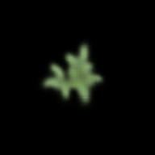
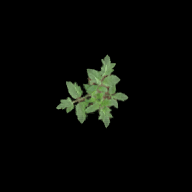
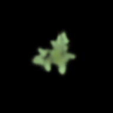
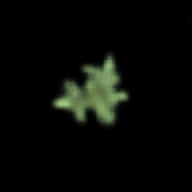
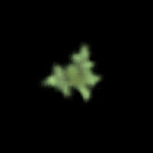
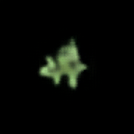
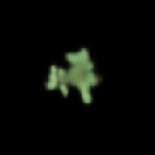
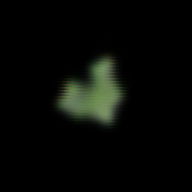
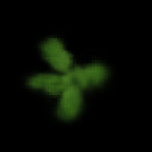
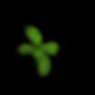

<div align="center">

# AgriSTL: An Agricultural Spatio-Temporal Learning Framework

<p align="center">
  
  
  
  
</p>

</div>

<p align="center">
  🌱 Plant growth prediction &nbsp; | &nbsp;
  🍅 Agricultural temporal learning &nbsp; | &nbsp;
  📈 Unified benchmark framework
</p>

[📘 Overview](#overview) |
[🛠️ Installation](#installation) |
[🚀 Getting Started](#getting-started) |
[🧠 Supported Methods](#overview-of-supported-methods-and-agricultural-tasks) |
[🎞️ Visualization](#visualization) |
[🆕 News](#news-and-updates) |
[🙏 Acknowledgement](#acknowledgement)

</div>

## Introduction

AgriSTL is an agricultural spatio-temporal learning framework built upon [OpenSTL](https://github.com/chengtan9907/OpenSTL) and further extended for agricultural predictive tasks. It is designed to provide a unified, extensible, and reproducible benchmark for temporal modeling from agricultural observations, with plant growth prediction as its primary focus.

Compared with generic spatio-temporal learning benchmarks, AgriSTL places greater emphasis on agricultural growth dynamics, especially the subtle and continuous developmental changes observed in seedling-stage plant image sequences. In addition to plant growth prediction as the core task, the framework also supports two complementary agricultural task directions, namely yield estimation and weather forecasting, thereby covering three representative agricultural temporal prediction scenarios within a common experimental pipeline.

At the current stage, AgriSTL integrates multiple recent temporal and spatio-temporal prediction models, and provides plant-oriented benchmark datasets covering Arabidopsis, Tomato, and Kale during the seedling stage. Among these directions, plant growth prediction remains the major focus of the current project.

<p align="center">
  
</p>

<p align="center">
  Overall framework of AgriSTL.
</p>

<p align="right">(<a href="#top">back to top</a>)</p>

## Overview

<details open>
<summary>Main Features and Plans</summary>

- <b>Agriculture-oriented benchmark design.</b>
  AgriSTL is designed for agricultural temporal learning rather than generic spatio-temporal benchmarks. It focuses particularly on plant growth prediction from image sequences, while also maintaining compatibility with yield estimation and weather forecasting.

- <b>Unified spatio-temporal learning pipeline.</b>
  AgriSTL extends the [OpenSTL](https://github.com/chengtan9907/OpenSTL) framework by integrating multiple representative temporal and spatio-temporal models into a common training and evaluation pipeline, making comparisons across methods more convenient and reproducible.

- <b>Plant-focused benchmark datasets.</b>
  The current benchmark includes seedling-stage growth datasets of Arabidopsis, Tomato, and Kale, aiming to support temporal plant development modeling in agricultural scenarios.

- <b>Future plans.</b>
  We plan to continue releasing benchmark datasets, experiment configurations, pretrained checkpoints, visualization resources, and additional baselines for agricultural temporal predictive learning.

</details>

<details open>
<summary>Code Structure</summary>

- `openstl/api` contains experiment runners and interfaces.
- `openstl/core` contains training utilities, optimization components, and metrics.
- `openstl/datasets` contains datasets and dataloaders.
- `openstl/methods` contains training methods for different predictive models.
- `openstl/models` contains the main network architectures.
- `openstl/modules` contains reusable layers and blocks.
- `configs/` contains task-specific and model-specific configuration files.
- `tools/` contains executable scripts for training, testing, and related utilities.
- [`RUN_SCRIPTS.md`](RUN_SCRIPTS.md) contains example running commands for experiments.

</details>

<p align="right">(<a href="#top">back to top</a>)</p>

## News and Updates

[2026-04-10] AgriSTL project repository is created.

[2026-04-10] Initial README and project structure are organized.

[Coming Soon] Benchmark datasets, checkpoints, and more detailed experimental resources will be released gradually.

## Installation

AgriSTL can be installed in a conda environment.

```shell
git clone https://github.com/LYQ1107/AgriSTL.git
cd AgriSTL
conda env create -f environment.yml
conda activate AgriSTL
python setup.py develop
```

If you prefer a manual environment setup, you may also use:

```shell
conda create -n agristl python=3.10 -y
conda activate agristl
pip install -r requirements.txt
```

<details close>
<summary>Basic dependencies</summary>

* python>=3.9
* torch
* timm
* numpy
* pandas
* matplotlib
* opencv-python
* scikit-image
* scikit-learn
* tqdm
* fvcore
* packaging

</details>

Please also ensure that the dependencies inherited from [OpenSTL](https://github.com/chengtan9907/OpenSTL) are correctly installed.

## Getting Started

For more detailed usage examples, please refer to [`RUN_SCRIPTS.md`](RUN_SCRIPTS.md).

A typical workflow in AgriSTL includes dataset preparation, configuration selection, model training, evaluation, and visualization. Example commands and running scripts will be organized and updated in [`RUN_SCRIPTS.md`](RUN_SCRIPTS.md).

<p align="right">(<a href="#top">back to top</a>)</p>

## Overview of Supported Methods and Agricultural Tasks

AgriSTL supports multiple representative spatio-temporal prediction methods and is designed for three typical agricultural task scenarios, with plant growth prediction as the main focus.

### Spatio-temporal prediction methods

<details open>
<summary>Currently supported methods</summary>
  
- ▸ ConvLSTM (NeurIPS'2015)
  
- ▸ PredRNN (NeurIPS'2017)
  
- ▸ PredRNN++ (ICML'2018)
- ▸ E3D-LSTM (ICLR'2018)
- ▸ MIM (CVPR'2019)
- ▸ PhyDNet (CVPR'2020)
- ▸ MAU (NeurIPS'2021)
- ▸ PredRNN.V2 (TPAMI'2022)
- ▸ SimVP (CVPR'2022)
- ▸ SimVP.V2 (ArXiv'2022)
- ▸ TAU (CVPR'2023)
- ▸ MMVP (ICCV'2023)
- ▸ SwinLSTM (ICCV'2023)
- ▸ WaST (AAAI'2024)
- ▸ EarthFormer (NeurIPS'2022)
- ▸ TimesNet (ICLR'2023)
- ▸ TimeMixer (ICLR'2024)
- ▸ iTransformer (ICLR'2024)
- ▸ DMVFN (CVPR'2023)
- ▸ PredFormer (ArXiv'2025)
- ▸ TimeSformer (ICML'2021)
- ▸ VMRNN (CVPR'2024)
- ▸ GMG (TCSVT'2026)
- ▸ Yield3DCNN (ArXiv'2024)
  
</details>

<details open>
<summary>Internal methods in this project</summary>

- ▸ RDMN (AgriSTL internal method, currently unpublished)
- ▸ DSAVFN (AgriSTL internal method, currently unpublished)

</details>

### Agricultural tasks

<details open>
<summary>Currently covered task scenarios</summary>

- ▸ Plant Growth Prediction  
  The primary task of AgriSTL. This task focuses on forecasting future plant growth states from historical observations, especially for seedling-stage visual development.

- ▸ Yield Estimation  
  A complementary agricultural downstream task currently included in the framework and to be expanded in future releases.

- ▸ Weather Forecasting  
  Another representative agricultural temporal task supported by the framework for broader agricultural applicability.

</details>

### Plant datasets

<details open>
<summary>Current plant benchmark datasets</summary>

- ▸ Arabidopsis
- ▸ Tomato
- ▸ Kale

</details>

### Notes

- Some methods are adapted and reorganized under the AgriSTL unified pipeline.
- RDMN and DSAVFN are proposed in this project and are currently unpublished.
- More baselines, detailed configurations, and benchmark reports will be released in future updates.

<p align="right">(<a href="#top">back to top</a>)</p>

## Pretrained Checkpoints

We currently maintain pretrained checkpoints for part of the datasets and supported methods in our internal experiments.

At this stage, the checkpoints are not yet publicly released, but they are being organized and are planned for future open-source release.

The planned release may include:

- plant growth prediction checkpoints on Arabidopsis, Tomato, and Kale
- corresponding configuration files
- benchmark result summaries
- inference examples and visualization scripts

## Visualization

We provide qualitative visualization results to illustrate the temporal prediction behavior of different methods on plant growth forecasting.

At the current stage, the visualization set focuses on two representative plant datasets:

- Arabidopsis
- Tomato

For each dataset, we provide 10 qualitative GIF results. In total, this section contains 20 GIFs. The compared methods include one GT result and nine representative prediction results.

### Tomato qualitative results

<div align="center">

| GT | RDMN | DSAVFN | TAU | MIM |
| :---: | :---: | :---: | :---: | :---: |
|  |  |  |  |  |

| PredRNNv2 | GMG | PhyDnet | MMVP | PredFormer |
| :---: | :---: | :---: | :---: | :---: |
|  |  |  |  |   |
.GIF" width="180px"> |

</div>

<p align="center">
  Qualitative visualization results on the Arabidopsis dataset.
</p>

### Arabidopsis qualitative results

<div align="center">

| GT | RDMN | DSAVFN | TAU | MIM |
| :---: | :---: | :---: | :---: | :---: |
|  |  |  |  |  |

| PredRNNv2 | GMG | PhyDnet | MMVP | PredFormer |
| :---: | :---: | :---: | :---: | :---: |
|  |  |  |  |   |
.GIF" width="180px"> |

</div>

<p align="center">
  Qualitative visualization results on the Tomato dataset.
</p>

### Notes

- These qualitative results are mainly used to demonstrate temporal evolution fidelity and appearance consistency in plant growth prediction.
- RDMN and DSAVFN are internal methods proposed in this project and have not yet been formally published.
- More visualization examples and organized result pages will be added in future updates.

<p align="right">(<a href="#top">back to top</a>)</p>

## Acknowledgement

AgriSTL is built upon [OpenSTL](https://github.com/chengtan9907/OpenSTL) and would not have been possible without the strong foundation provided by the OpenSTL project. We sincerely thank the authors and contributors of [OpenSTL](https://github.com/chengtan9907/OpenSTL) for building a comprehensive, modular, and highly valuable benchmark framework for spatio-temporal predictive learning. Their open-source effort provides the essential basis upon which AgriSTL is developed and extended toward agricultural applications. We also thank the original authors of the integrated temporal prediction models for their valuable open-source contributions.

## Contact

For questions, suggestions, or collaborations, please open an issue on GitHub or contact the project maintainers.

GitHub Issues:  
https://github.com/LYQ1107/AgriSTL/issues

<p align="right">(<a href="#top">back to top</a>)</p>
